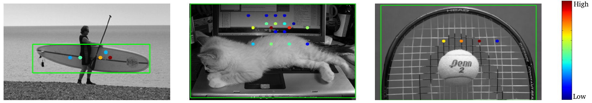

# Reducing Label Noise in Anchor-Free Object Detection

Official PyTroch implementation of PPDet based on open-mmlab's mmdetection.

> [**Reducing Label Noise in Anchor-Free Object Detection**](https://arxiv.org/abs/2008.01167),            
> Nermin Samet, Samet Hicsonmez, [Emre Akbas](http://user.ceng.metu.edu.tr/~emre/),        
> *BMVC 2020. ([arXiv pre-print](https://arxiv.org/abs/2008.01167))*        

## Summary
Current anchor-free detectors label all features within a ground-truth box as positive. However features within a ground-truth box may come from (i) the background, (ii) occluders or (iii) non-discriminatory parts of the object. PPDet avoids treating such features as positive. For example in the image below, the colored dots show the locations whose predictions are pooled to generate the final detection shown in the green bounding box. The color denotes the contribution weight. Highest contributions are coming from the objects and not occluders or background areas.



Current anchor-free object detectors label all the features that spatially fall inside a predefined central region of a ground-truth box as positive. This approach causes la- bel noise during training, since some of these positively labeled features may be on the background or an occluder object, or they are simply not discriminative features. In this paper, we propose a new labeling strategy aimed to reduce the label noise in anchor-free detectors. We sum-pool predictions stemming from individual features into a single pre- diction. This allows the model to reduce the contributions of non-discriminatory features during training. We develop a new one-stage, anchor-free object detector, PPDet, to em- ploy this labeling strategy during training and a similar prediction pooling method during inference. On the COCO dataset, PPDet achieves the best performance among anchor- free top-down detectors and performs on-par with the other state-of-the-art methods. It also outperforms all state-of-the-art methods in the detection of small objects (AP<sub>s</sub> 31.4).

## Highlights
- PPDet (Prediction Pooling Detector) is a new relaxed labelling strategy for anchor-free object detection.
- To reduce the contribution of non-discriminatory features during training, PPDet **sum-pool** predictions stemming from individual features into a single prediction.
- PPDet is uses a novel prediction pooling strategy in training and inference.
- PPDet is state-of-the-art method in the detection of small objects with AP<sub>s</sub> 31.4.
- Our best model achieves *46.3* AP on COCO test-dev.

## Results on COCO val2017
| Backbone  | Inf time (fps) | AP / AP<sub>50</sub> | Multi-scale AP / AP<sub>50</sub>| Download |
|:---------:|:---------------:|:------:|:------:|:--------:|
| ResNet-50  | 8.7           | 36.3 / 54.3   | 39.9 / 56.9  | [model](https://drive.google.com/file/d/1z29WWEyF3_fcUYNZ4sluP_sRd95dJATL/view?usp=sharing) |
| ResNet-101 |      7.1          | 40.5 / 59.5   | 45.0 / 63.0   | [model](https://drive.google.com/file/d/1a2K4rUE7S9Bck2vqK7KENVq0cB1qI2Dv/view?usp=sharing) |
| ResNeXt-101-64x4d |   4.1      | 41.8 / 61.3   | 46.1 /  64.3  | [model](https://drive.google.com/file/d/1a58emT4Gw2ORdcF0MPVLJbx6JrkmJmxM/view?usp=sharing) |


- *For multi scale testing we used scales of (800, 480), (1067, 640), (1333, 800), (1600, 960), (1867, 1120) and (2133, 1280).*

## Installation
PPDet is implemented on top of [mmdetection](https://github.com/open-mmlab/mmdetection). Therefore the installation is the same as original mmdetection.

You could check [INSTALL.md](INSTALL.md) for installation instructions.


## Train and inference
The PPDet configs could be found in [configs/ppdet](configs/ppdet).

### Inference
    # single-gpu testing
    python tools/test.py ${CONFIG_FILE} ${CHECKPOINT_FILE} [--out ${RESULT_FILE}] --eval bbox [--show]

    # multi-gpu testing
    ./tools/dist_test.sh ${CONFIG_FILE} ${CHECKPOINT_FILE} ${GPU_NUM} [--out ${RESULT_FILE}] --eval bbox

### Training
    # single-gpu training
    python tools/train.py ${CONFIG_FILE}

    # multi-gpu training
    ./tools/dist_train.sh ${CONFIG_FILE} ${GPU_NUM} [optional arguments]

## Acknowledgement

This work was supported by the AWS Cloud Credits for Research program and by the Scientific and Technological Research Council of Turkey (TÜBİTAK) through the project titled "Object Detection in Videos with Deep Neural Networks" (grant number 117E054). The numerical calculations reported in this paper were partially performed at TÜBİTAK ULAKBİM,  High Performance and Grid Computing Center (TRUBA resources).

## License

PPDet is released under the Apache License (refer to the [LICENSE](LICENSE) file for details). We developed PPDet on top of open-mmlab's [mmdetection](https://github.com/open-mmlab/mmdetection). Please refer to the License of [mmdetection](https://github.com/open-mmlab/mmdetection) for more detail.

## Citation

If you find PPDet useful for your research, please cite our paper as follows.

> N. Samet, S. Hicsonmez, E. Akbas, "Reducing Label Noise in Anchor-Free Object Detection",
> In British Machine Vision Conference (BMVC), 2020.

BibTeX entry:
```
@inproceedings{PPDet,
  author = {Nermin Samet and Samet Hicsonmez and Emre Akbas},
  title = {Reducing Label Noise in Anchor-Free Object Detection},
  booktitle = {British Machine Vision Conference (BMVC)},
  year = {2020},
}
```
